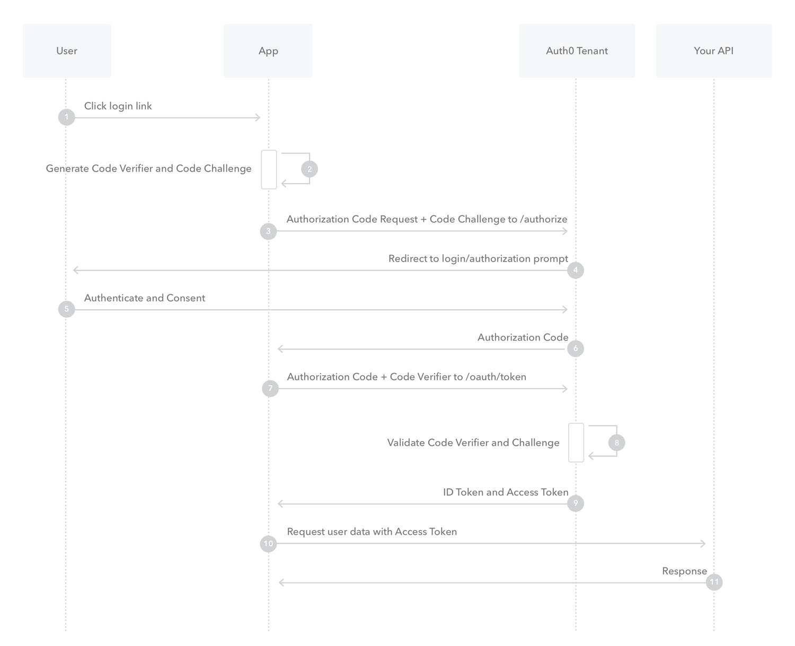

# Auth

## Confidential and Public Applications

[Source](https://auth0.com/docs/get-started/applications/confidential-and-public-applications)

根据 [OAuth 2.0 spec](https://tools.ietf.org/html/rfc6749#section-2.1), 应用程序可以分为机密和公开两类. 主要是根据应用程序有没有能力掌控证书的安全性来划分的.

### Confidential Application

机密应用程序能够保证证书的安全性, 不会将证书暴露给未授权的他人. 即这种应用程序有一个可信任的后端服务来保证证书的安全性.

#### Grant Types

由于机密应用程序使用受信任的后台服务器, 因此他们可以通过传送 Client ID 和 Client Secret 到 Token endpoint 来进行身份验证. 同样的, 也可以使用 Post 或 Basic Token endpoint authentication method.

机密应用程序可以考虑采用如下的认证工作流:

- 使用 [Authorization Code Flow](https://auth0.com/docs/get-started/authentication-and-authorization-flow/authorization-code-flow), [Resource Owner Password Flow](https://auth0.com/docs/get-started/authentication-and-authorization-flow/resource-owner-password-flow), 或者采用具有领域支持的资源所有者密码工作流.
- 使用 [Client Credentials Flow](https://auth0.com/docs/get-started/authentication-and-authorization-flow/client-credentials-flow) 对于 machine-to-machine (M2M)

#### ID Tokens

因为机密应用程序有能力保证 secrets 的安全, 你可以颁发给他们一个 ID Token 采用下面两种方法中的一个进行签名:

- 对称加密, 使用他们的客户端秘钥 (HS256).
  > _Symmetrically, using their client secret (HS256)_
- 非对称加密, 使用一个秘钥 (RS256).
  > _Asymmetrically, using a private key (RS256)_

### Public Applications

公开应用程序不能保证证书的安全.

#### Grant Types

此类应用程序由于不能保证他们自己证书的安全, 因此他们不能发送客户端秘钥作为认证依据.

公开应用程序可以考虑如下的认证流:

- 原生桌面或移动端应用程序可以使用 [Authorization Code Flow with PKCE](https://auth0.com/docs/get-started/authentication-and-authorization-flow/authorization-code-flow-with-proof-key-for-code-exchange-pkce)
- 基于 JavaScript 的客户端应用程序(SPA)可以使用 [Implicit Flow](https://auth0.com/docs/get-started/authentication-and-authorization-flow/implicit-flow-with-form-post)

#### ID Token

因为公开应用程序不能保证安全, 因此 ID Token 颁发给他们是必须满足:

- 采用非对称加密, 使用私钥 (RS256)
  > Signed asymmetrically using a private key (RS256)
- 使用公钥对采用私钥签名的 Token 进行校验
  > Verified using the public key corresponding to the private key used to sign the token

## Authentication and Authorization Flows

[Source](https://auth0.com/docs/get-started/authentication-and-authorization-flow)

Auth0 uses the [OpenID Connect (OIDC) Protocol](https://auth0.com/docs/authenticate/protocols/openid-connect-protocol) and [OAuth 2.0 Authorization Framework](https://auth0.com/docs/authenticate/protocols/oauth) to authenticate users and get their authorization to access protected resources.

### Authorization Code Flow

[Source](https://auth0.com/docs/get-started/authentication-and-authorization-flow/authorization-code-flow)

因为常规的 web apps 是 server-side apps, 即源代码是不对外暴露的, 因此他们能够使用 Authorization Code Flow, 用于交换 Token.

1. The user clicks **Login** within the regular web application.
2. Auth0's SDK redirects the user to the Auth0 Authorization Server (`/authorize` endpoint).
3. Your Auth0 Authorization Server redirects the user to the login and authorization prompt.
4. The user authenticates using one of the configured login options and may see a consent page listing the permissions Auth0 will give to the regular web application.
5. Your Auth0 Authorization Server redirects the user back to the application with an authorization `code`, which is good for one use.
6. Auth0's SDK sends this `code` to the Auth0 Authorization Server (`/oauth/token` endpoint) along with the application's Client ID and Client Secret.
7. Your Auth0 Authorization Server verifies the code, Client ID, and Client Secret.
8. Your Auth0 Authorization Server responds with and ID Token and Access Token (and optionally, a Refresh Token).
9. Your application can use the Access Token to call an API to access information about the user.
10. The API responds with requested Data.

### Authorization Code Flow with Proof Key for Code Exchange (PKCE)

[Source](https://auth0.com/docs/get-started/authentication-and-authorization-flow/authorization-code-flow-with-proof-key-for-code-exchange-pkce)

在认证期间, 移动端和原始应用程序能够使用 Authorization Code Flow, 但是需要额外的加密措施. 另外, 对于 SPA 为了解决安全问题, OAuth 2.0 提供了一个 Authorization Code Flow 的 PKCE 版本.

Public Applications 有如下的安全隐患

- **Native Apps**
  - 不能安全的存储 Client Secret. 反编译这个 app 会得到 Client Secret.
  - 可以利用自定义 URL 方案来捕获重定向, 可能允许恶意应用程序从您得授权服务器接收授权码.
- **Single-page apps (SPA)**
  - 因为所有的源代码都运行在浏览器中, 所以没有办法安全存储 Client Secret.

1. The user clicks **Login** within the application.
2. Auth0's SDK creates a cryptographically-random `code_verifier` and from this generates a `code_challenge`.
3. Auth0's SDK redirects the user to the Auth0 Authorization Server (`/authorize` endpoint) along with the `code_challenge`.
4. Your Auth0 Authorization Server redirects the user to the login and authorization prompt.
5. The user authenticates using one of the configured login options and may see a consent page listing the permissions Auth0 will give to the application.
6. Your Auth0 Authorization Server store the `code_challenge` and redirects the user back to the application with an authorization `code`, which is good for one use.
7. Auth0's SDK sends this `code` and the `code_verifier` (create in step 2) to the Auth0 Authorization Server (`/oauth/token` endpoint).
8. Your Auth0 Authorization Server verifiers the `code_challenge` and `code_verifier`.
9. Your Auth0 Authorization Server responds an ID token and access token (and optionally, a refresh token).
10. Your application can use the access token to call an API to access information about the user.
11. The API responds with requested data.

这种方案因为不能存储保密信息(比如: Client secrets), 因此使用如下方法:

1. 客户端生成一个随机的"密码验证器"(`code_verifier`), 同时用这个"密码验证器"生成一个密码(`code_challenge`). 这可以看做是一对密码, 可以用其中一个验证另外一个.
2. 在请求 Authorization Code 的时候, 将 `code_challenge` 发送给 Auth0 Authorization Server.
3. 在用户认证成功后, Auth0 Authorization Server 将 Authorization Code 返回给客户端的同时, 会将 `code_challenge` 存储下来.
4. 客户端通过 Authorization Code + `code_verifier` 来请求 Token.
5. Auth0 Authorization Server 通过 `code_verifier` 和本地存储的 `code_challenge` 来验证.

### Implicit Flow with Form Post

[Source](https://auth0.com/docs/get-started/authentication-and-authorization-flow/implicit-flow-with-form-post)

这个方案已不被推荐, 建议采用 PKCE.

### Hybrid Flow

### Client Credentials Flow

### Device Authorization Flow

### Resource Owner Password Flow

## OpenID Connect Protocol

[Source](https://auth0.com/docs/authenticate/protocols/openid-connect-protocol)

## OAuth 2.0 Authorization Framework

[Source](https://auth0.com/docs/authenticate/protocols/oauth)
